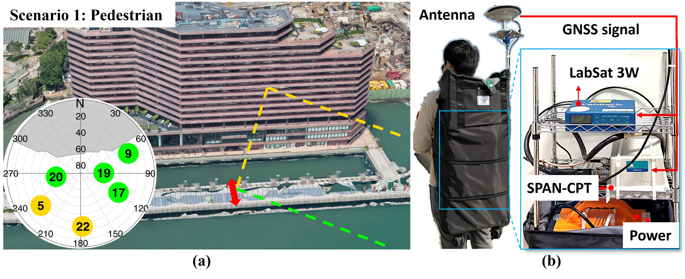
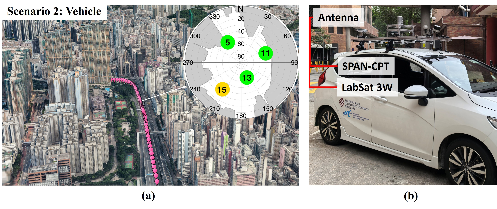

# 📡 Open GNSS Dataset  

This repository provides open-source Global Navigation Satellite System (GNSS) data collected in urban areas of Hong Kong. The dataset includes:  
- **Scenario 1 (S1):** Pedestrian user moving near a building.  
- **Scenario 2 (S2):** Vehicle navigating in a dense urban canyon.  

This dataset is valuable for research on GNSS multipath detection and mitigation.  

---

## 🏗 Experiment Details  

### Scenario 1: Pedestrian Test  
- **Location:** Tsim Sha Tsui, Hong Kong  
- **Date (UTC):** 13 Feb 2025  

Figure 1 shows the experiment setup and environment. Signals arriving from the south are reflected off the building surface, leading to both direct and reflected receptions. The sky plot in Fig. 1(b) presents satellite visibility and ray-tracing-based signal classification. Using ground truth, satellite ephemeris, and 3D building models, the ray-tracing simulates the most probable propagation paths. Results suggest:  
- **PRN 22:** susceptible to multipath during the entire test.  
- **PRN 5:** affected only during specific epochs.  

<figure>
  
  <figcaption><b>Figure 1:</b> (a) Test environment and trajectory (red arrow). For the skyplot: Green = LOS, Orange = multipath (ray-tracing). (b) Equipment setup.</figcaption>
</figure>  

Figure 2 shows the pedestrian’s trajectory. The user walks back and forth perpendicular to the building to:  
1. Increase velocity projection on the signal path → amplifying Doppler shift of reflections.  
2. Capture time-varying Doppler shifts → improving multipath characterization.  

<figure>
  
  <figcaption><b>Figure 2:</b> Pedestrian trajectory.</figcaption>
</figure>  

---

### Scenario 2: Vehicle Test  
- **Location:** Mong Kok, Hong Kong  
- **Date (UTC):** 06 Mar 2025  

Figure 3 shows the environment and setup. This scenario involves:  
- Rapid satellite–receiver geometry changes.  
- Frequent signal blockages.  
- High noise due to user dynamics.  

Ray-tracing detects multipath events supported by reflection geometry. Although short-lived, these events demonstrate the reliability of the proposed estimator in modeling Doppler oscillations.  

<figure>
  
  <figcaption><b>Figure 3:</b> (a) Urban test trajectory (pink). For the skyplot: Green = LOS, Orange = multipath (ray-tracing) (b) Equipment setup.</figcaption>
</figure>  

---


## 📂 Dataset Contents  

- `S1_GT_20250213_1Hz.txt` – Ground truth of Scenario 1 (coming soon).  
- `S2_GT_20250603_1Hz.txt` – Ground truth of Scenario 2 (coming soon).  
- `S1_suburban_HK.md` – Link to Scenario 1 GPS IF data.  
- `S2_urban_HK.md` – Link to Scenario 2 GPS IF data (coming soon).  
- `images/` – Photos of the experimental setup.  

---

## 📑 Data Format  

**Intermediate Frequency (IF) Data**  
- Sampling Frequency: 58 MHz  
- IF Frequency: 4.58 MHz  
- Format: 8-bit I/Q samples  
- Observation Type: GPS L1  

| Dataset      | Ground Truth (TXT)           | IF Data (BIN)          | Equipment           |
|--------------|------------------------------|------------------------|---------------------|
| Scenario 1   | `S1_GT_20250213_1Hz.txt` (40 KB, TBA) | `S1_suburban_HK.bin` (9.9 GB)  | LabSat 3W, NovAtel SPAN-CPT, NovAtel GPS-703-GGG| 
| Scenario 2   | `S2_GT_20250603_1Hz.txt` (49 KB, TBA) | `S2_urban_HK.bin` (11 GB)      | LabSat 3W, NovAtel SPAN-CPT, NovAtel GPS-703-GGG |

- **Antenna:** [NovAtel GPS-703-GGG](https://novatel.com/support/previous-generation-products-drop-down/previous-generation-products/gps-703-ggg-antenna)  
- **Receiver:** [LabSat 3 Wideband](https://www.labsat.co.uk/index.php/en/products/labsat-3-wideband)  
- **Ground Truth:** [NovAtel SPAN-CPT](https://novatel.com/products/gnss-inertial-navigation-systems), 1 Hz  

---

## 📥 Download & Usage  

Ground truth data will be released upon publication.  
Scenario 1 IF data can be downloaded from:  
👉 [S1_suburban_HK.bin (Dropbox link)](https://www.dropbox.com/scl/fi/o18ejryo123upfvks5s7w/Urban_HK.bin?rlkey=kxjpoz51fv3lzg8lnnrkk2sqe&st=4u7w5bqw&dl=0)  

📩 For questions, contact: [jingxiaotao2.fang@connect.polyu.hk](mailto:jingxiaotao2.fang@connect.polyu.hk)  

---

## 📖 Citation  

If you use this dataset, please cite:  
```bibtex
TBC
