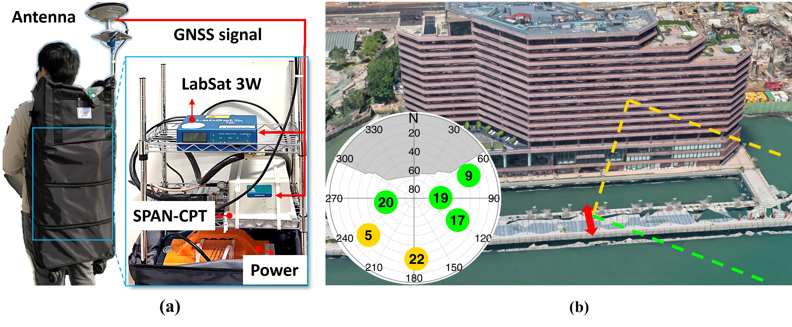

# 📡 Open GNSS Dataset  

This repository provides open-source Global Navigation Satellite System (GNSS) data collected from a suburban area in Hong Kong. The dataset captures scenarios where a dynamic pedestrian user is subject to pure multipath interference. It is valuable for GNSS multipath detection/mitigation research.

## 📂 Dataset Contents
- `GT_20250213_10Hz.txt` – Ground truth data in text format  
- `Urban_HK.bin` – GPS intermediate frequency (IF) data in binary format (not yet available)
- `images/` – Photos of the experimental setup  

## 🏗 Experiment Details
- **Location:** Tsim Sha Tsui, Hong Kong  
- **Date (UTC):** 13/02/2025
- **Antenna Type:** [NovAtel (GPS-703-GGG)](https://novatel.com/support/previous-generation-products-drop-down/previous-generation-products/gps-703-ggg-antenna)
- **GNSS Receiver:** [LabSat 3 Wideband](https://www.labsat.co.uk/index.php/en/products/labsat-3-wideband)
- **Ground truth:** [NovAtel SPAN-CPT](https://novatel.com/products/gnss-inertial-navigation-systems), 10 Hz

Figure 1 illustrates the experiment setup and test environment. It is likely that signals originating from the south are reflected off the building surface, resulting in the reception of both direct and reflected signals. The sky plot in Figure 1(b) presents satellite visibility and signal classification results obtained from ray-tracing techniques. By incorporating user ground truth information, satellite ephemeris, and 3D building models, the ray-tracing algorithm simulates the most probable signal propagation paths. As a result, the analysis indicates that PRN 22 is geometrically susceptible to multipath interference throughout the entire test, while PRN 5 is likely to experience multipath interference during specific epochs of the experiment.
<figure>
  
  <figcaption>Figure 1: (a) Equipment setup and (b) test environment in suburban Hong Kong, showing the test trajectory (red arrow) and sky plot. Satellites in
green indicate LOS signals, while those in orange represent multipath interference based on ray-tracing analysis.</figcaption>
</figure>


Figure 2 illustrates the pedestrian's motion pattern. The pedestrian moves back and forth perpendicular to the building surface for several reasons. First, this motion increases the velocity projection onto the signal path, thereby amplifying the Doppler shift of the reflected signal. Second, the time-varying nature of the reflected signal’s Doppler shift helps characterize its impact on receiver measurements, providing valuable insights into multipath interference effects.
<figure>
  
  <figcaption>Figure 2: User trajectory.</figcaption>
</figure>

## 📑 Data Format
- **Sampling Frequency:** 58 MHz
- **IF Frequency:** 4.58 MHz
- **Data Format：** 8-bit I/Q samples
- **Observation Type:** GPS L1

| DataSets    | Urban_HK.bin       | GT_20250213_10Hz.txt |
|-------------|--------------------|----------------------|
| Total Size  | 9.96 GB (87 seconds)      |      443 KB (102 seconds)   |
| Equipments  | LABSAT 3W          | NovAtel SPAN-CPT, 10 Hz|
| Antenna     | NovAtel (GPS-703-GGG) | NovAtel (GPS-703-GGG) |

## 📥 Download & Usage  
The GPS IF data will be made publicly available upon publication of the paper.
You can download the dataset directly from the [GitHub repository]([https://github.com/yourusername/GNSS-OpenData](https://github.com/Fangjingxiaotao/GNSS-OpenIF)).  
For questions or further details, please contact: [jingxiaotao2.fang@connect.polyu.hk](mailto:jingxiaotao2.fang@connect.polyu.hk)

### **Citation**

If you use this work for your research, you may want to cite:  
```bash
TBC

